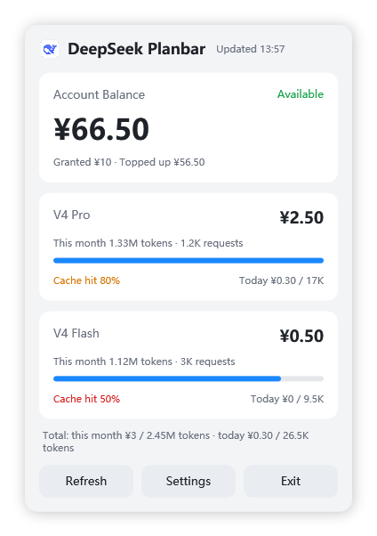
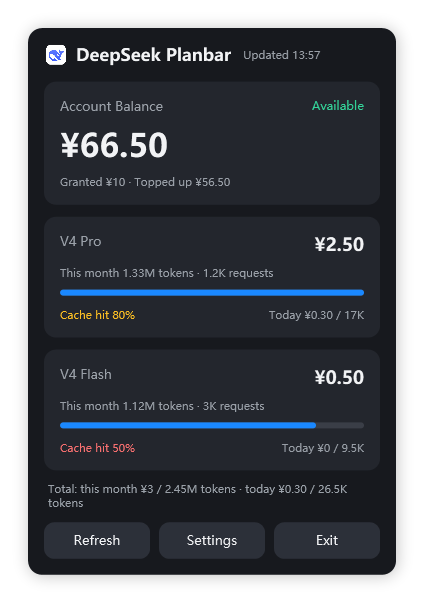

# deepseek-planbar

[中文](README_CN.md)

A Windows tray app that shows your **DeepSeek balance and token usage** at a glance — no more opening <https://platform.deepseek.com/usage> every day.

> Unofficial tool, not affiliated with DeepSeek. The usage endpoints are DeepSeek's internal web APIs (no public SLA) and may change without notice; the balance endpoint is an official public API.
>
> Sister projects: **[kimi-planbar](https://github.com/baigong-ai/kimi-planbar)** (Kimi Code quota statusline) and **kimi-planbar-tray** (the WPF tray skeleton this app is adapted from).

Light | Dark
---|---
 | 

## What it shows

- **Balance card** — total balance (granted + topped-up), availability status; turns red when the balance runs low (< ¥10)
- **Per-model usage cards** — one card per model (V4 Pro, V4 Flash, ...): month cost, month tokens with a relative bar, cache hit rate (green ≥85% / yellow 60–84% / red <60%), today's cost and tokens
- **Totals line** — month cost/tokens and today's cost/tokens across all models
- Tray tooltip shows balance + month cost; left-click toggles the panel, right-click opens the menu

The panel auto-refreshes on a configurable interval (1/5/10/30 min), retries after 30 s on failure, and keeps showing the last good data when a refresh fails.

## Two credentials (both required, mutually incompatible)

| data | endpoint | credential | lifetime |
|---|---|---|---|
| balance | `GET https://api.deepseek.com/user/balance` | API Key (`sk-...`, created in the console) | long-lived |
| token usage / cost | `GET https://platform.deepseek.com/api/v0/usage/amount|cost` | web login token (`userToken`) | short-lived, re-acquire on expiry |

How to get the usage token — two ways:

- **In-app login (recommended)**: Settings → "Sign in via browser to sync (recommended)" → log in to DeepSeek in the embedded WebView2 window (QR code / SMS / password all work). The token is captured from the login session, verified against the usage endpoint, and saved automatically — no F12 needed. Repeat whenever the token expires.
- **Manual (always works)**: log in to <https://platform.deepseek.com> in your browser → press `F12` → Console → run `JSON.parse(localStorage.userToken).value` → copy the result into Settings.

The API Key is entered manually once (it is long-lived; existing keys are only shown masked in the console, so they cannot be auto-imported from the web session). New values are verified against the real endpoints before being saved; a 401 means the value is invalid or expired.

## Build & run

Requires the .NET 8 SDK on Windows.

```bash
cd tray-wpf
dotnet build
./bin/Debug/net8.0-windows/DeepseekPlanbarTray.exe
```

The app lives in the system tray. Open Settings from the panel or the right-click menu to paste your API Key and usage token.

## Release builds

Two single-file flavors — one exe each, nothing else to ship (both x64, both need the WebView2 Runtime, which ships with Windows 11 and most Windows 10):

```bash
cd tray-wpf
# framework-dependent (~1.4 MB, needs the .NET 8 Desktop Runtime installed):
dotnet publish -c Release -r win-x64 --self-contained false -p:PublishSingleFile=true -p:IncludeNativeLibrariesForSelfExtract=true -o publish
# self-contained (~69 MB, no .NET install needed):
dotnet publish -c Release -r win-x64 --self-contained true -p:PublishSingleFile=true -p:EnableCompressionInSingleFile=true -p:IncludeNativeLibrariesForSelfExtract=true -o publish-sc
```

Most users should take the self-contained build; pick the small one only if you already have the .NET 8 Desktop Runtime. `IncludeNativeLibrariesForSelfExtract` folds the native WebView2/WPF DLLs into the exe (they self-extract to a temp dir on first run).

## Where files live

- Settings (theme / refresh interval / autostart): `%APPDATA%/DeepseekPlanbarTray/settings.json` — or next to the exe when a `portable.dat` file sits beside it (portable mode)
- Credentials: `%USERPROFILE%/.deepseek-planbar/credentials.json` (your profile directory is private to your Windows account by default). Environment variables `DEEPSEEK_API_KEY` / `DEEPSEEK_USER_TOKEN` take precedence when set
- Cache: `%USERPROFILE%/.deepseek-planbar/cache.json` — last successful fetch, written atomically; shown when a refresh fails

Credentials never leave your machine except to call `api.deepseek.com` / `platform.deepseek.com`, and are never committed to git. Note: a leaked API Key can be used to spend your balance; a leaked usage token exposes your usage history. Rotate keys if in doubt.

## Headless self-checks

```bash
# parse-layer assertions against tests/fixtures (no credentials needed)
DeepseekPlanbarTray.exe --test-fixtures path/to/tests/fixtures

# one-shot fetch, prints JSON and exits (structured errors when unconfigured/offline)
DeepseekPlanbarTray.exe --test-fetch

# construct all windows to validate XAML/resources
DeepseekPlanbarTray.exe --test-ui

# initialize WebView2 for real (verifies single-file self-extraction)
DeepseekPlanbarTray.exe --test-webview

# render the panel to PNG (mock data, either theme)
DeepseekPlanbarTray.exe --screenshot out.png --mock [--dark]
```

## Repo layout

| path | what it is |
|---|---|
| `tray-wpf/` | the WPF tray app (.NET 8) |
| `tests/fixtures/` | sample API responses used by `--test-fixtures` |
| `scripts/convert_logo.py` | converts `deepseek.webp` → `tray-wpf/deepseek-logo.png` |
| `docs/` | screenshots |

## Acknowledgements

- Usage endpoint shapes and headers verified against [DeepSeekMonitorWindows](https://github.com/Joyi-code/DeepSeekMonitorWindows) (MIT)

## License

MIT. Unofficial community tool — use at your own risk; the internal usage API may change, and you are responsible for keeping your credentials safe.
